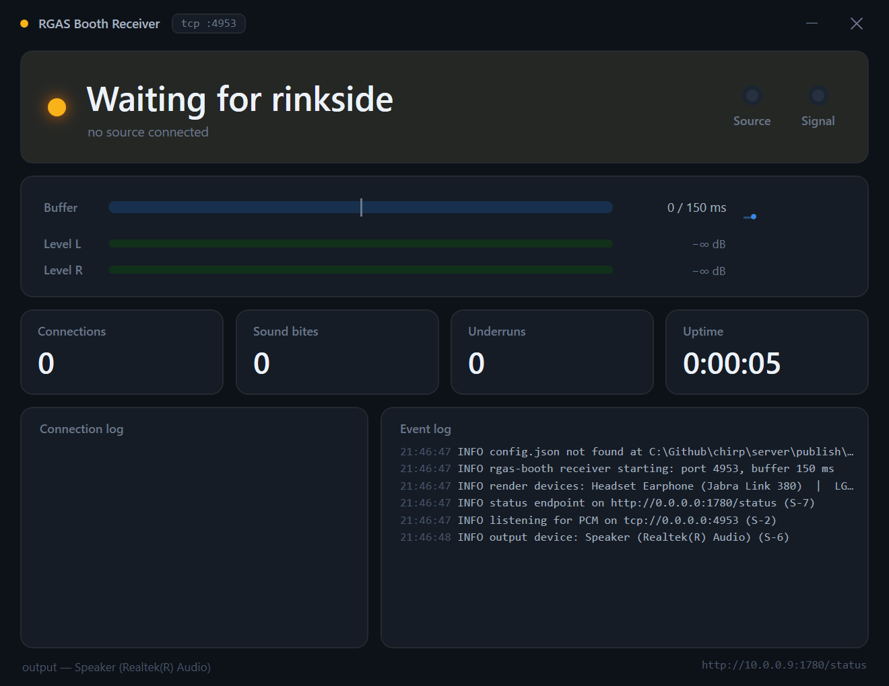

<div align="center">

# 🏒 RGAS — Rink Game Audio System

### Broadcast-grade game audio for volunteer-run hockey rinks.

**Press the spacebar. The goal horn fires in a quarter-second. That's the whole learning curve.**

RGAS turns any two Windows laptops into a low-latency, self-healing PA system —
a touch-friendly soundboard at the scorekeeper's bench that streams over WiFi to
an unattended receiver in the announcer's booth. No mixer training, no cueing,
no cables to the bench, no cloud.

</div>


---

## Why it exists

Community rinks run game audio on donated gear and rotating volunteers who were
handed the aux cable five minutes ago. The result is predictable: songs start on
their weak intros, levels lurch between tracks, and the goal horn arrives two
seconds late over a Bluetooth cast — if it arrives at all. The equipment lives in
the booth; the person lives at the bench, too far for Bluetooth to hold.

**RGAS fixes the whole chain by design:**

- ⚡ **Under 300 ms, button to PA** — the goal horn feels *instant*, not "eventually."
- 🎛️ **Zero-training operator surface** — four modes and a spacebar, the muscle memory of a play clock. No mixer, no settings.
- 🔊 **Consistent, loud, clean** — every clip loudness-normalized so nothing is quiet, hot, or opens on a bad intro.
- 🩹 **Unattended and self-healing** — the booth boots straight to working audio after a power cut; a WiFi blip reconnects in ~1 second, untouched.
- 💻 **Any laptop, no install** — copy a folder, double-click. No drivers, no runtime, no internet.

---

## How it works

```
  RINKSIDE  (scorekeeper bench)              BOOTH  (announcer booth)
 ┌───────────────────────────┐             ┌───────────────────────────┐
 │  RGAS Soundboard           │   5 GHz     │  RGAS Receiver            │
 │  • 4 modes + spacebar      │   WiFi      │  • jitter buffer (150 ms) │
 │  • goal horn (hold key)    │  ────────▶  │  • live status dashboard  │
 │  • clip capture + trim     │  TCP :4953  │  • auto-recover on boot   │
 │  • mixes + streams PCM ────┼── raw PCM ──┼─▶ WASAPI → mixer / PA     │
 └───────────────────────────┘             └───────────────────────────┘
     any Windows 11 laptop                   a fixed Windows 11 laptop
```

One continuous PCM stream, one open socket, one output zone. The soundboard mixes
everything itself and pushes it straight to the booth — no virtual audio cables,
no capture hop, no encoder. The booth buffers against WiFi jitter and plays out.

---

## Features

### 🎧 Booth Receiver (`server/`) — the appliance nobody touches

|  |  |
|---|---|
| **Live status dashboard** | Color-coded **WAITING / BUFFERING / ON AIR**, source & signal indicator lights, and a read-only design that can't be misconfigured mid-game. |
| **Real-time meters** | True L/R output levels with peak-hold, a buffer-fill gauge, and a 45-second buffer sparkline — all computed from the actual PCM leaving for the PA. |
| **Telemetry** | Connection history, a live event log, and running counts of connections, **sound bites** played, and buffer underruns. |
| **Jitter buffer** | Tunable 80–250 ms prebuffer with automatic underrun recovery and a latency anchor that trims backlog so lag never creeps after a hiccup. |
| **Follows your speakers** | Change the Windows output device and audio re-routes within a second; a dead device rebuilds automatically — never a silent PA. |
| **Boots to working audio** | One admin script hardens the machine (auto-login, no-sleep, firewall, silent Windows sounds, update windows) so a power cycle returns to sound in under two minutes, hands-off. |

### 🎚️ Rinkside Soundboard (`client/`) — the zero-training surface

|  |  |
|---|---|
| **Four modes, one spacebar** | `1` Pump Up · `2` Stop-in-Action · `3` Relax · `4` Silence. Spacebar plays / fades. Play-clock simple. |
| **Instant goal horn** | Hold `H` — a hot-mastered horn fires over the music, ducking it, and finishes clean on release. |
| **Global hotkeys** | An armed mode captures keys even when the app isn't focused, so scorekeeping never steals them. |
| **Collections** | Organize clips into collections per mode; shuffle or play in order. |
| **Build clips at the rink** | A Capture tab records system audio or imports files, trims on a waveform, loudness-normalizes, and files the clip — no offline pipeline. |
| **Self-healing stream** | Reconnects to the booth within ~1 second of any drop, forever, with an always-visible connection light. |

---

## Screenshots

**On air** — receiving, playing, and metering a live stream to the PA:


**Waiting** — the calm, unmistakable idle state before a source connects:



---

## Quick start

**Booth machine** (once):
```powershell
# from the published folder, as Administrator
.\install.ps1 -AutoLogonUser booth -AutoLogonPassword "your-password"
```
Set BIOS "Restore on AC Power Loss = Power On", reboot, and it comes up on its own.

**Rinkside laptop**: copy the app folder, double-click `RgasSoundboard.exe`, click
**SCAN** to find the booth. Done.

Full details: [server/README.md](server/README.md) · [client/README.md](client/README.md)
· operator card [docs/OPERATOR-CARD.md](docs/OPERATOR-CARD.md)

---

## Built spec-first

Every behavior is a numbered requirement before it is code. The master
specification is [spec/RGAS.md](spec/RGAS.md); each app derives traceable
requirements (`S-*` booth, `C-*` rinkside) with an implementation map and an
acceptance-test mapping.

| Component | Role | Spec |
|---|---|---|
| [server/](server/) | **rgas-booth** — Windows 11 receiver appliance | [server/SPEC.md](server/SPEC.md) |
| [client/](client/) | **rgas-source** — portable Windows 11 soundboard | [client/SPEC.md](client/SPEC.md) |

Change the spec, then the code. Commits reference requirement IDs.

## Tech

.NET 8 · WPF · NAudio (WASAPI) · single-file self-contained executables (no
runtime install) · raw PCM over TCP · PowerShell provisioning. Everything is
LAN-local and runs with the building internet down.

## Non-goals

Multiroom sync · lip-sync to video · internet streaming · replacing casual music
playback outside games. RGAS does one thing: get a button-press to the rink PA,
fast and reliably, in hands that have never seen a mixer.

<div align="center">
<sub>Rink Game Audio System · TVMHA · built for the people who forgot they volunteered for this.</sub>
</div>
