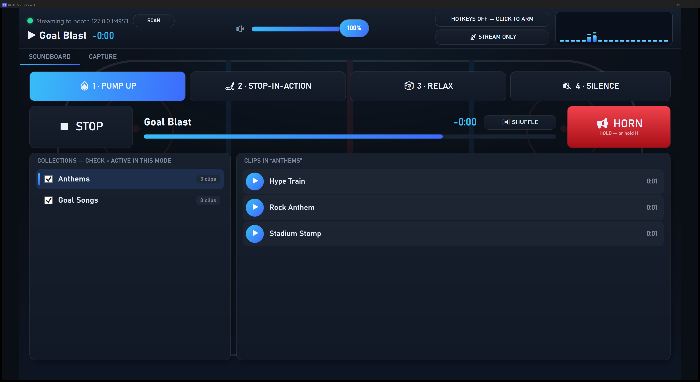
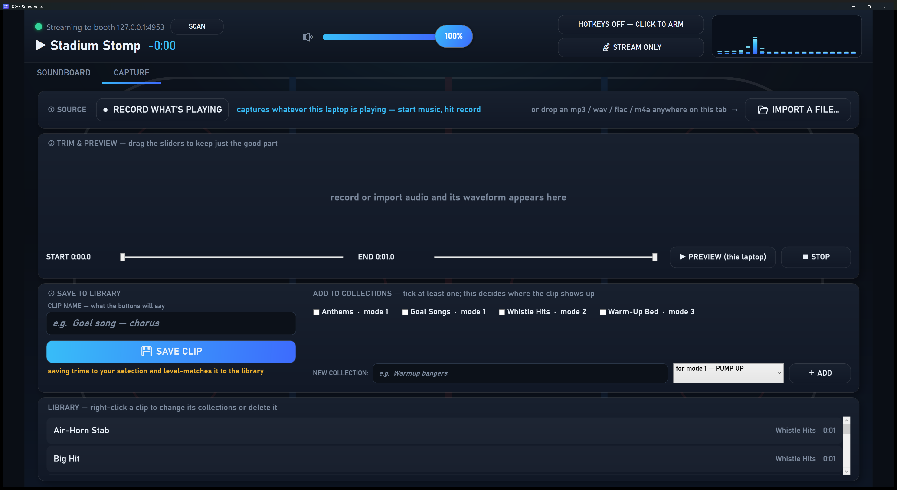
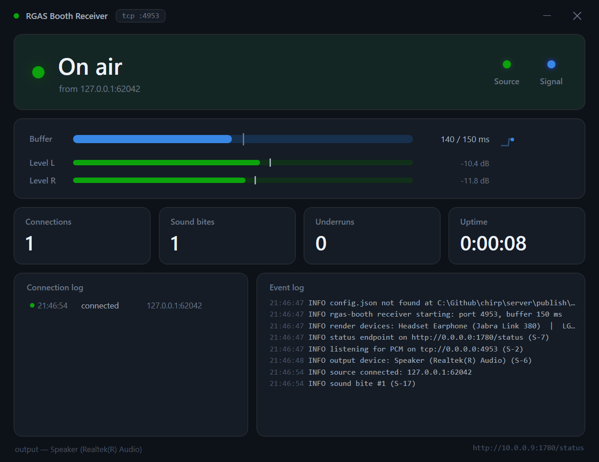

<div align="center">

# 🏒 RGAS — Rink Game Audio System

### Broadcast-grade game audio for volunteer-run hockey rinks.

**Press the spacebar. The goal horn fires in a quarter-second. That's the whole learning curve.**

RGAS is two apps that turn any pair of Windows laptops into a low-latency,
self-healing PA system: a touch-friendly **soundboard** at the scorekeeper's
bench that streams over WiFi to an unattended **receiver** in the announcer's
booth. No mixer training, no cueing, no cables to the bench, no cloud.

</div>



---

## Why it exists

Community rinks run game audio on donated gear and rotating volunteers who were
handed the aux cable five minutes ago. The result is predictable: songs start on
their weak intros, levels lurch between tracks, and the goal horn arrives two
seconds late over a Bluetooth cast — if it arrives at all. The equipment lives in
the booth; the operator sits at the bench, too far for Bluetooth to hold.

**RGAS fixes the whole chain by design:**

- ⚡ **Under 300 ms, button to PA** — the goal horn feels *instant*, not "eventually."
- 🎛️ **Zero-training operator surface** — four modes and a spacebar, the muscle memory of a play clock. No mixer, no settings.
- 🔊 **Consistent, loud, clean** — every clip loudness-normalized so nothing is quiet, hot, or opens on a bad intro.
- 🩹 **Unattended and self-healing** — the booth boots straight to working audio after a power cut; a WiFi blip reconnects in ~1 second, untouched.
- 💻 **Any laptop, no install** — copy a folder, double-click. No drivers, no runtime, no internet.

---

## How it works

```
  RINKSIDE  (scorekeeper bench)              BOOTH  (announcer booth)
 ┌───────────────────────────┐             ┌───────────────────────────┐
 │  RGAS Soundboard           │   5 GHz     │  RGAS Receiver            │
 │  • 4 modes + spacebar      │   WiFi      │  • jitter buffer (150 ms) │
 │  • goal horn (hold key)    │  ────────▶  │  • live status dashboard  │
 │  • clip capture + trim     │  TCP :4953  │  • auto-recover on boot   │
 │  • mixes + streams PCM ────┼── raw PCM ──┼─▶ WASAPI → mixer / PA     │
 └───────────────────────────┘             └───────────────────────────┘
     any Windows 11 laptop                   a fixed Windows 11 laptop
```

One continuous PCM stream, one open socket, one output zone. The soundboard mixes
everything itself and pushes it straight to the booth — no virtual audio cables,
no capture hop, no encoder. The booth buffers against WiFi jitter and plays out.

---

# 🎚️ The Soundboard (rinkside)

The zero-training surface the volunteer actually touches. It runs on any Windows
11 laptop as a single portable `.exe` — copy it on, double-click, done.

### How the operator runs a game

1. **Pick a mode** — `1` Pump Up · `2` Stop-in-Action · `3` Relax · `4` Silence
   (click, or press the number). The active mode glows.
2. **Spacebar plays and stops** — it starts the next track from the mode's pool
   and fades out on the next press. Same rhythm as running a play clock.
3. **Hold `H` for the goal horn** — a hot-mastered horn fires instantly over the
   music, ducking it, and finishes clean when you let go.
4. **Arm hotkeys** (one button) so `Space` / `1`–`4` / `H` work even while you're
   clicking around the scorekeeping app — the keys never collide.

Everything else — collections, shuffle vs. in-order, the connection light, master
volume, and the STOP button — is one glance away and impossible to break. Worst
case is the wrong song; the next spacebar fixes it.

### Build clips right at the rink — no offline pipeline



The **Capture** tab is a three-step clip factory:

1. **Record what's playing** (WASAPI loopback — grab a song straight off Spotify
   or YouTube) or **drop in** an mp3 / wav / flac / m4a.
2. **Trim** to the good part on a waveform, and preview locally (never to the PA).
3. **Name it, tick its collections, save.** RGAS loudness-normalizes it so every
   button plays at the same level, and files it into the mode you chose.

Collections let a clip live in many groups; each group belongs to one mode. The
active pool is the union of the mode's selected collections.

---

# 🎧 The Receiver (booth)

The appliance nobody touches. One self-contained `.exe` that accepts the PCM
stream, buffers it, and plays it into the mixer — with a status dashboard so
anyone can see it's healthy from across the room.



| Feature | What it does |
|---|---|
| **Live status dashboard** | Color-coded **WAITING / BUFFERING / ON AIR**, source & signal lights, read-only so it can't be misconfigured mid-game. |
| **Real-time meters** | True L/R output levels with peak-hold, a buffer gauge, and a 45-second buffer sparkline — computed from the actual PCM leaving for the PA. |
| **Telemetry** | Connection history, a live event log, and running counts of connections, **sound bites** played, and buffer underruns. |
| **Jitter buffer** | Tunable 80–250 ms prebuffer with automatic underrun recovery and a latency anchor that trims backlog so lag never creeps. |
| **Follows your speakers** | Change the Windows output device and audio re-routes within a second; a dead device rebuilds itself — never a silent PA. |
| **Boots to working audio** | One admin script hardens the machine (auto-login, no-sleep, firewall, silent Windows sounds, safe update windows) so a power cycle returns to sound in under two minutes, hands-off. |

---

## Quick start

**Booth machine** (once):
```powershell
# from the published folder, as Administrator
.\install.ps1 -AutoLogonUser booth -AutoLogonPassword "your-password"
```
Set BIOS "Restore on AC Power Loss = Power On", reboot, and it comes up on its own.

**Rinkside laptop**: copy the app folder, double-click `RgasSoundboard.exe`, click
**SCAN** to find the booth. Done.

Full details: [server/README.md](server/README.md) · [client/README.md](client/README.md)
· operator card [docs/OPERATOR-CARD.md](docs/OPERATOR-CARD.md)

---

## Built spec-first

Every behavior is a numbered requirement before it is code. The master
specification is [spec/RGAS.md](spec/RGAS.md); each app derives traceable
requirements (`S-*` booth, `C-*` rinkside) with an implementation map and an
acceptance-test mapping.

| Component | Role | Spec |
|---|---|---|
| [client/](client/) | **rgas-source** — portable Windows 11 soundboard | [client/SPEC.md](client/SPEC.md) |
| [server/](server/) | **rgas-booth** — Windows 11 receiver appliance | [server/SPEC.md](server/SPEC.md) |

Change the spec, then the code. Commits reference requirement IDs.

## Tech

.NET 8 · WPF · NAudio (WASAPI) · single-file self-contained executables (no
runtime install) · raw PCM over TCP · PowerShell provisioning. Everything is
LAN-local and runs with the building internet down.

## Non-goals

Multiroom sync · lip-sync to video · internet streaming · replacing casual music
playback outside games. RGAS does one thing: get a button-press to the rink PA,
fast and reliably, in hands that have never seen a mixer.

<div align="center">
<sub>Rink Game Audio System · TVMHA · built for the people who forgot they volunteered for this.</sub>
</div>
